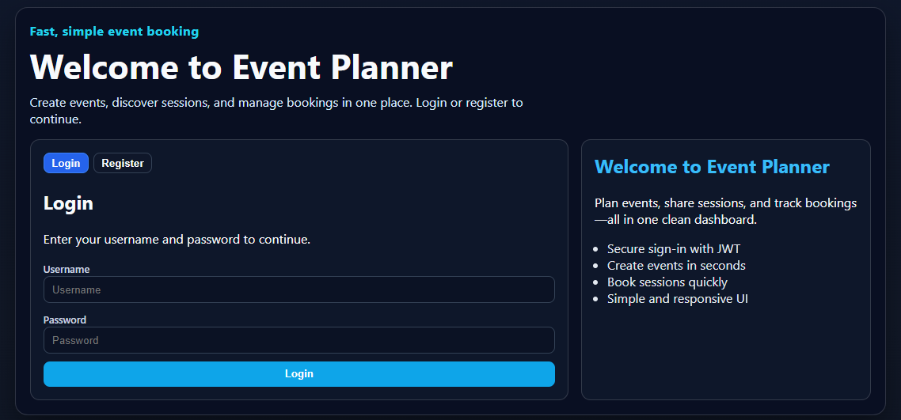
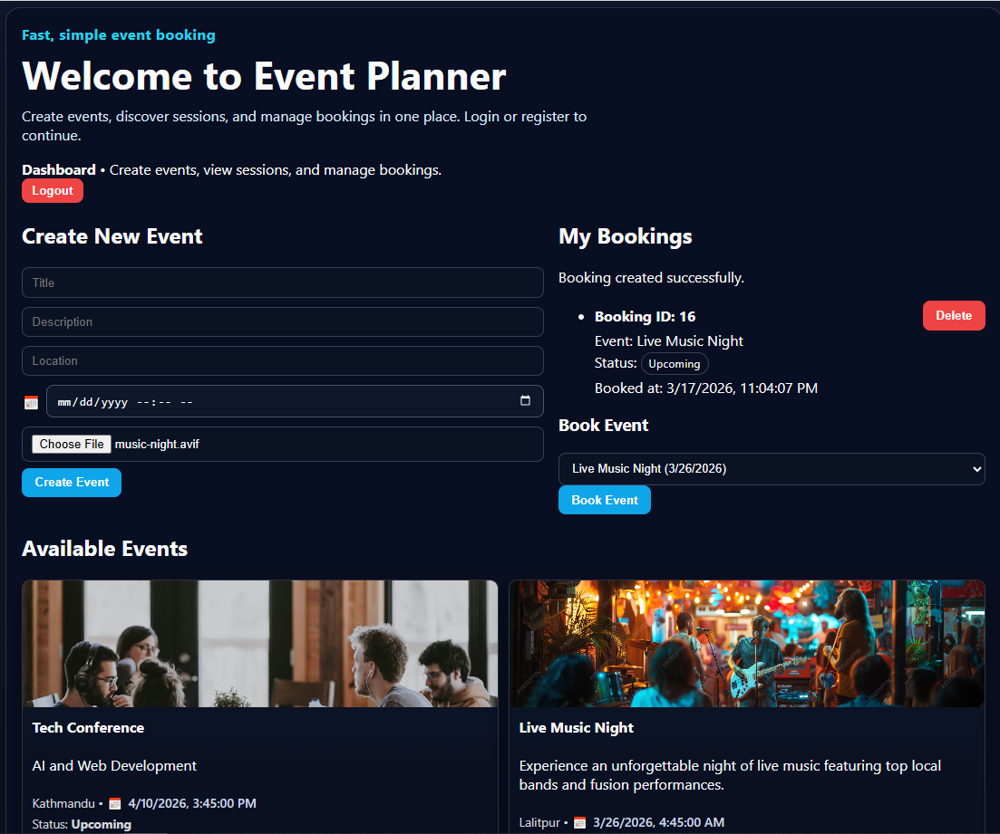
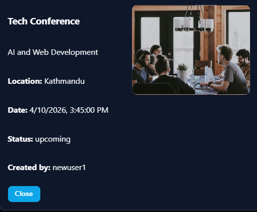

# Project Manual – Event Booking System

## 1. Introduction
This manual explains how users interact with the Event Booking System and how the key flows work on frontend and backend.

## 2. System Workflow
1. User registers via `/register` API.
2. User logs in and receives JWT token.
3. Frontend stores the token and sends it in `Authorization: Bearer` for protected requests.
4. User creates events via `POST /api/events/`.
5. Users view events in the dashboard list.
6. Users book events via `POST /api/bookings/`.
7. Creators can edit/delete/complete their own events.
8. Completed events cannot be booked.

## 3. Screenshots (Example Pages)
### 3.1 Login Page

*Use this screenshot to show login form.*

### 3.2 Dashboard (Create + Booking + Event List)

*Shows create event form, booking panel, and events list.*

### 3.3 Event Details Modal

*Shows event details and image in side-by-side layout.*

## 4. Step-by-Step User Flow
### User registration and login
1. Open frontend URL (e.g., `http://localhost:5173`).
2. Register with username/password.
3. Login and verify the dashboard appears.

### Create Event
1. Fill title, description, location, date/time.
2. Optional: upload image.
3. Click `Create Event`.
4. Event appears in available event grid.

### Book Event
1. In `Book Event` dropdown, choose an upcoming event.
2. Click `Book Event`.
3. Booking appears under `My Bookings`.
4. If event is completed, booking is blocked.

### Edit/Delete/Complete Event
1. For events created by you, click `Edit` or `Delete` from event card.
2. Click `Complete` to mark an event completed.
3. Completed events show status `completed` and cannot be booked.

## 5. Backend API Endpoints
- `POST /api/register/` (create user)
- `POST /api/token/` (login token)
- `GET/POST/PUT/DELETE /api/events/`
- `POST /api/events/<id>/complete/`
- `GET/POST/DELETE /api/bookings/`

